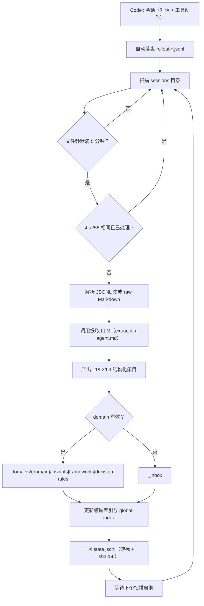

# KC：自动记忆编译流水线

KC 是一个零依赖的本地知识提取工具：监听 Codex 自动落盘的会话文件（rollout），调用独立的 LLM 把对话和工具动作提炼成 L1 洞察 / L2 框架 / L3 决策规则，写回 Markdown 知识库。

核心目标是让「知识萃取」由事件确定性触发，而不是靠模型自觉。

## 技术方案

更完整的设计、数据流和分层说明见 [骨架/knowledge-compiler-replacement-plan.md](./骨架/knowledge-compiler-replacement-plan.md)；提取规则见 [项目细节/提取规则.md](./项目细节/提取规则.md)，实现契约见 [项目细节/系统规格.md](./项目细节/系统规格.md)。

## 流程



## 目录

- `src/`：代码
- `scripts/`：任务计划程序包装脚本
- `config/.env.example`：配置模板
- `config/extraction-agent.example.md`：外部提取 LLM 的提示词模板
- `fixtures/`：测试夹具
- `.state/`：游标与状态（git 忽略）
- `知识库/`：提取结果输出（git 忽略，可用 `KC_KNOWLEDGE_DIR` 指到别处）

## 快速开始

1. 复制配置：

   ```powershell
   Copy-Item config/.env.example config/.env
   ```

2. 填写 `config/.env`：

   - `EXTRACT_LLM_API_KEY`：提取 LLM 的 key，空则走 mock 提取。
   - `EXTRACT_LLM_BASE_URL` / `EXTRACT_LLM_MODEL`：OpenAI 兼容接口，或本地 Ollama。
   - `KC_SESSIONS_DIR`：Codex 的 sessions 目录。

3. 运行：

   ```bash
   npm run scan          # 单次扫描
   npm run watch         # 持续监听
   npm run process -- fixtures/sample-rollout.jsonl
   ```

## 自定义提取 LLM 的提示词

`config/extraction-agent.example.md` 是给外部提取 LLM 的系统提示词模板。

复制为 `config/extraction-agent.md`，按自己的领域、分类和示例修改。代码会把 `config/extraction-agent.md` 作为 system 消息发给提取模型。

## 配置项

| 变量 | 说明 | 默认 |
| :--- | :--- | :--- |
| `EXTRACT_LLM_API_KEY` | 提取 LLM key，空则走 mock | 空 |
| `EXTRACT_LLM_BASE_URL` | OpenAI 兼容 base URL | `https://api.deepseek.com/v1` |
| `EXTRACT_LLM_MODEL` | 模型名 | `deepseek-chat` |
| `KC_SESSIONS_DIR` | Codex sessions 目录 | `~/.codex/sessions` |
| `KC_KNOWLEDGE_DIR` | 知识库输出目录 | 项目内 `knowledge_library` |
| `KC_COOLDOWN_MS` | 文件静默阈值(ms) | `300000` |
| `KC_SCAN_INTERVAL_MS` | 监听扫描间隔(ms) | `60000` |

## 部署

推荐用 Windows 任务计划程序定时跑 `scan`（把路径换成你的项目路径）：

```powershell
schtasks /create /tn "KC-extract" /sc minute /mo 10 /tr "<你的KC项目路径>\scripts\scan.bat"
```

近实时监听可手动运行 `scripts\watch.bat`。

## 说明

试行版为保持零依赖，使用纯 Node.js ESM + 轮询扫描；后续可按 `项目细节/系统规格.md` 替换。
